# **'Focal' Spelling Game**

Focal is a fun interactive game for children aged approximately 4-6 who would are beginning to learn how to spell small words and enjoy guessing challenges. It is based loosely on the popular NYTimes 5-letter word guessing game called 'Wordle'. In 'Focal', players must use the clue image to guess what 3-letter word needs to be spelled and then they have three chances to spell it. The title 'Focal' refers to the Irish word for 'word'.

<br>

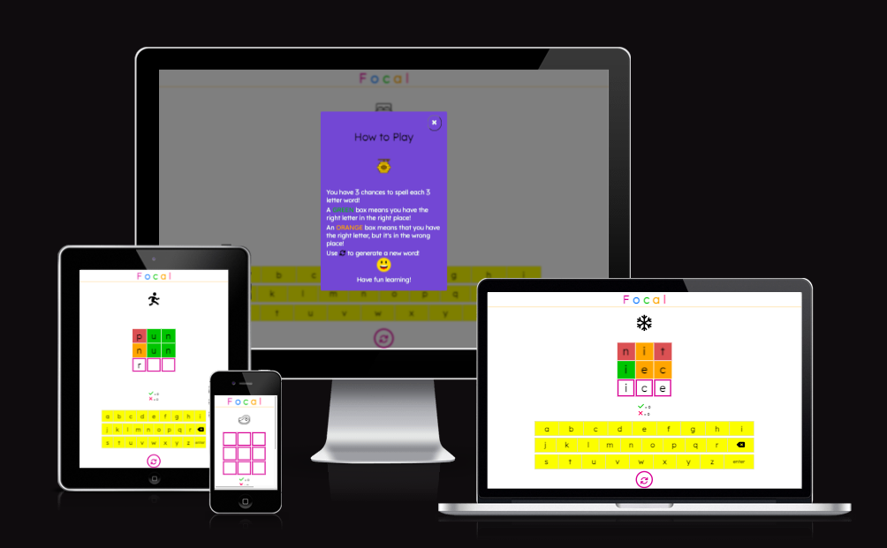

<br>

[View the Focal site on GitHub Pages](https://brionico.github.io/focalpp2/)

<br>

## **CONTENTS**

* [User Experience (UX)](#user-experience-ux)
    * [Strategy](#strategy)
        * [Project Goals](#project-goals)
        * [User Stories](#user-stories)
    * [Design](#design)
        * [Wireframes](#wireframes)
        * [Features](#features)
        * [Colour Palette](#colour-palette)
        * [Typography](#typography)
        * [Imagery](#imagery)
* [Technologies Used](#technologies-used)
    * [Languages Used](#languages-used)
    * [Frameworks, Libraries and Programs Used](#frameworks-libraries-and-programs-used)
* [Testing](#testing)
    * [Automated Testing](#automated-testing)
        * [W3C Validator](#w3c-validator)
        * [JSHint](#JSHint)
        * [Lighthouse](#lighthouse)
    * [Manual Testing](#manual-testing)
        * [Testing User Stories](#testing-user-stories)
        * [Further Testing](#full-testing)
* [Bugs](#bugs)
    * [Known Bugs](#known-bugs)
    * [Solved Bugs](#solved-bugs)
* [Deployment](#deployment) 
* [Credits](#credits)
    * [Code Used](#code-used)
    * [Content](#content)
    * [Media](#media)
    * [Acknowledgements](#acknowledgements)

# **User Experience (UX)**

## **STRATEGY**
___

## **Project Goals**

<br>

To help young children, aged circa 3-6 years old with their spelling by providing a simple and engaging game. The game was designed with the developer's own early school age child's learning in mind. The developer set out to create the game as a fun and interactive learning tool. It is informed by the learning materials used by schools at Junior infants and Senior infants level. 
 
Similar to the NYTimes's popular Wordle game, Focal guides the user towards the solution by displaying a green colour block on the game grid if the user has placed the correct letter in the correct place, an orange block if a correct letter has been chosen but put in the wrong place, and a red block if the letter does not feature in the word. 
It is designed to be played along with full or partial supervision by a child's parents, much in the way homework is overseen by parents. Apart from the pop-up messages, there is a minimal amount of text to make it easy for children to navigate through the game. 

<br>

## **User Stories**

<br>

### Visitor Goals:

<br>

* As a visitor, I want a fun and engaging educational experience that helps with my spelling.
* As a visitor, I want to be engaged and encouraged to hit certain spelling targets to keep the experience interesting and challenging.
* As a visitor, I need the game to be responsive over a range of device sizes.
* As a visitor, I want to be able to keep track of my incorrect and correct guesses. 
* As a visitor, I want clear and concise feedback each time I submit a correct or incorrect answer.
*  As a visitor, I want easy intuitive access to an explanation of how to play the game.
* As a visitor I want to be greeted by game that looks like it has been designed with me in mind. 

<br>

## **DESIGN**
___

## **Wireframes**

<br>

The wireframes for Focal were produced in [Figma](https://figma.com) and were designed with a mobile-first approach in mind. 
Please note that the final site varies slightly from the wireframes. As the learning process developed, so too did the look of the site.
There are some features that were conceptualised at this point but were not implemented due to time and current skill constraints. These have been added to the [Future Implementations](#future-implementations) section below.

<br>


<br>

## **Features**

<br>

### **Game Instructions Modal:**

<br>

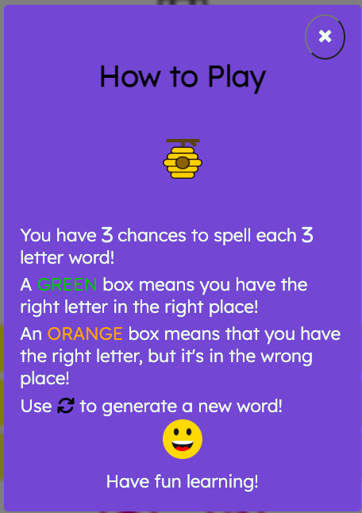

Once the user loads the page they are greeted by a pop-up modal that explains the game's simple instructions. 
This is similar to how the NYTimes present their instructions for 'Wordle' and was directly inspired by this. [NYTimes Wordle welcome page](https://www.nytimes.com/games/wordle/index.html). This modal uses the Bootstrap method to pop-up at page load. 

The instructions contain fun and bright images that communicate that the game is designed for children. There is a reference to the well-known 'spelling bee' game in the image of the beehive. 

The background is blurred out by an overlay while the instructions modal is visible which is aesthetically pleasant. This modal can be closed by clicking on the 'x' on the top right corner of the modal box. 

<br>

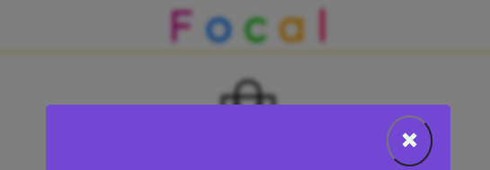

<br>

### **Gameboard and Image:**

<br>

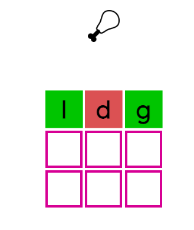

<br>

The gameboard is where the player inputs letters to spell the 3-letter word they think the image represents. 
The three columns of the grid represent the three guesses that the player has. The board was created using flex box to negate the need for too many media queries.
The clue images are clear and fun and some represent the word to be spelled more directly than others, which adds to the guessing component of the game.
There are two images put in the shuffle for fun; images to represent 'poo' and 'pee'. As anyone with a child is all too aware, toilet humour is their absolute favourite humour and so the existence of these adds an additional element of delight. 

The user must guess the word and spell it correctly by clicking on each letter in the right order.  
Once the player is happy with their spelling of the word, they can submit their answer with the 'enter' button. This is then checked against the correct spelling of the word and the player is provided feedback. The boxes bounce using an imported animation from [CSS animate](https://animate.style/) and each turns a particular colour. 
<br>
The colour green means that the right letter has been placed in the right spot, the colour orange means a correct letter has been chosen but it is in the wrong spot and the colour red means that the letter is not in the word. 
If the player's answer matches, all squares turn green and the score is incremented by 1. 
<br>

### **Keyboard:**

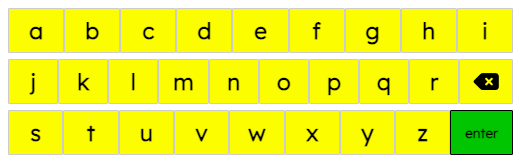

The onscreen keyboard introduces the child user to the concept of a keyboard layout but is set in alphabetic order so that it is not too difficult for younger users to locate letters. The 'enter' button has been made to stand out by colouring it green.
On the keyboard, the delete key gives the player the opportunity to delete unchecked inputs and is decorated with a font awesome icon.
<br>

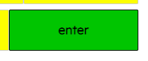

<br>

 This button is used to submit the guessed word. It is coloured brightly and in keeping with the colour palette used in the rainbow coloured game title. There is a subtle hover effect added to the keys; the letters shift to the same pink that features on the game board and the title on a cursor hover. 

<br>

### **Game Outcome Feedback:**

Alert modals pop out at various intervals with congratulations and warnings. When the user has reached 5 words spelt correctly, the modal will congratulate them. A congratulatory modal also appears after 10 words have been spelt correctly.

### **Score Counter**

The score counter, in keeping with the rest of the game, is simple and clear.
The wrong answer span is only incremented by 1 when all 3 tries to spell the word have been used up, so that young children are not disheartened by the existence of too many red X's. 

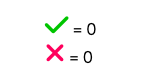

<br>

### **Another Feature**

The intention of the game is to use as little written navigation elements as possible so that it is more intuitive for young users. Informed by this intent, the only navigation option available to the user is the recycle button to generate a new word. The commonly used 'recycle' symbol communicates its purpose intuitively. This ensures that it is possible for young children to play the game without much knowledge of how words are spelled. This button generates a new word and clue image when clicked. 
The styling of the recycle word button is consistent with the rest of the game and has a hover effect applied to the clickable icon. 


<br>

### **Page Title**
The rainbow page title was achieved using a series of spans that were individually coloured within the HTML document. The developer's son responds positively to anything rainbow-coloured and so the title styling was chosen as per this preference.
<br>


<br>


| Responsiveness |    |           |            |           |                         |                  |       | Notes  |
| :---: | :---:        | :---:     | :---:      | :---:     | :---:                   | :---:            | :---: | :---:  |
| ---   | iPhone 6/7/8 | iPhone 11 | Galaxy S8+ | iPad Mini | iPad | Macbook Pro 2021 | Desktop > 1200px | 1Phone 6/7/8. Galaxy S8+ & iPad Mini tested virtually using Chrome DevTools. |   
| Site responsive >= 700px | n/a | n/a | n/a | Good | Good | Good | Good |
| Site responsive < 699px | Good | Good | Good | n/a | n/a | n/a | n/a |
| Images display as expected | Pass | Pass | Pass | Pass | Pass | Pass | Pass |
| Renders as expected | Pass | Pass | Pass | Pass | Pass | Pass | Pass |

<br>

### **Accessibility:**

To ensure that the game is as accessible as possible for all users and compatible with screen readers, I included the following:

* Colour contrast ratio was checked across the site to ensure that it meets acceptable standards. The [W3 colour chart](https://www.w3schools.com/colors/color_tryit.asp?hex=6A5ACD) was used when choosing the colour palette to ensure that the contrast between background colours and text would be acceptable and provide enough contrast. Some adjustment was needed in the welcome modal; a white background was added to the spans containing 'Green' and 'Orange'. 
* Aria labels for interactive elements such as buttons have been used.
* Descriptive alt attributes have been given to all images. The alt description for each picture is stored within each object in the wordCollection array. 
* 
### **Future Features:**

* When the game was being conceptualise the developer planned to utilize sound effects at each keyboard click and a winning bell sound for each correct answer submitted. Unfortunately, the implementation of this element was not poissible at this time due to limited time and skill but could be used as an additional form of feedback for players in the future, with increased JS knowledge.  This could also add an extra element of fun to the game for children.
* A great future feature would be the inclusion of longer word challenges and levels. 
* A countdown timer would be a challenging and interactive addition in the future. 
* At the conceptualization stage, the developer hoped to add a full size congratulations pop up modal with animated confetti. This feature was not implemented due to time constraints. 
* A lot more words and images could eventually be stored in the wordCollection array to keep the challenges varied and reduce the amount of times the same word appears.
* A 404 error page would be a good future feature. 

<br>

## **Colour Palette**

Colours used are bright, vivid and fun to appeal to the target audience. 
A rainbow colour palette was chosen as this was the developer's son's favourite colour combination. 
The rainbow palette of colours suggested by ____ on this info page was used with some adjustments to the red shade. 

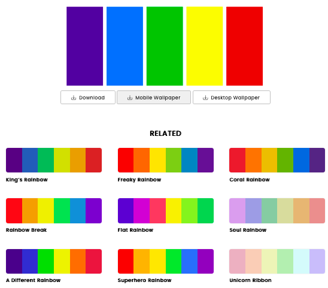

<br>

## **Typography**

Lexend was the Google fotn chosen as it is a clear and playful font choice that worked well with all the elements. A fall-back of sans-serif has been set. 

## **Imagery**

As this is a game aimed at children, imagery appropriate for this goal has been used.  The picture hints were sourced royalty free from [uxwing](https://uxwing.com/).  
The images are simple, clear and appealing to children. 
The bee hive image displayed on the landing modal ties in with the traditional theme of a Spelling Bee.

The styling of the answer grid is simple and reminiscent of Wordle- this familiar imagery should mean that the game is intuitive to parents guiding young users and the purpose of the game becomes apparent without even reading the instructions.

Player controls are kept minimal and styled in a way that makes game play intuitive.  The pink recycle button invites the player to generate a new word, communicating its purpose to the young player without any need for text.

<br>

# **Technologies Used**

## **Languages Used**

<br>

HTML, CSS and JavaScript were used to create the game.

<br>

## **Frameworks, Libraries and Programs Used**

<br>

* [CSS animate](https://animate.style/) used to create the bouncing box animations
* Git -  Version control.
* GitHub - All files for the website stored and saved in a repository.
* GitHub Pages - Used to deploy the final version of the website.
* [Figma](https://figma.com/wireframes/) was used to create the wireframes.
* The icons came from [Font Awesome](https://fontawesome.com/).
* [Google Chrome DevTools](https://developer.chrome.com/docs/devtools/)- Used throughout build of website for debugging, checking responsiveness and trialing new features/ styling.
* Google Lighthouse - Used at testing stage to show statistics for performance, accessibility,  best practices and SEO.
* Am I Responsive? - For displaying images of how the website looks across a range of devices.
* The font came from [Google Fonts](https://fonts.google.com/).
* This tutorial by developer Ian Lenehan was an invaluable resource in the structuring of the skeleton of the game. (https://www.youtube.com/watch?v=j7OhcuZQ-q8)
*  [StackEdit](https://stackedit.io/) for markup.
* Bootstrap and JQuery was used for the pop-up modal. 
* The Readme used as a guiding template was from Ewan Colquhoun for Wawas woods: [Wawas woods](https://github.com/EwanColquhoun/wawaswoods). In addition, instructions on how to fork a repository were quoted from this readme. 


<br>

# **Testing**

## **Automated Testing**

<br>

### **W3C Validator:**

<br>

I used the [W3C](https://validator.w3.org/) Markup Validation Service to validate the index.html page. It returned one warning: "Warning: The type attribute is unnecessary for JavaScript resources." After some research I learned that this is a problem that stems directly from the developer of the Bootstrap code that allows the pop-up modal to function. Unfortunately I could not find a solution that allows the rest of my code to function unhindered. See discussion: [W3C Validator error discussion on Wordpress](https://wordpress.org/support/topic/how-to-remove-unnecessary-type-attribute-for-javascript/)

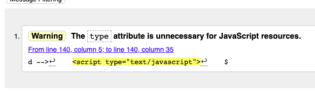

<br>

I used the [W3C jigsaw](https://jigsaw.w3.org/css-validator/) CSS Validation Service to validate my CSS stylesheet. It passed with no errors:

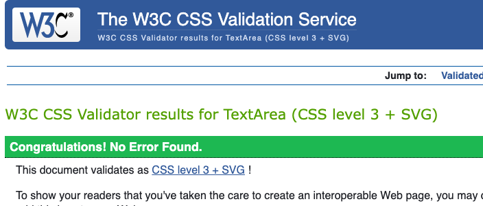

<br>

The following warnings were raised, which relate to the vendor extensions I am using for browser cross compatibility:


<br>

### **JSHint:**

<br>

I passed my JavaScript code through the linter JSHint to validate and check for any syntax errors.  There is a warning relates to the variable wordCollection as this is defined in the words.js file. Another warning states that "functions declared within loops referencing an outer scoped variable" - I cannot address this without breaking the code before the submission time. 
 

### **Lighthouse:**

<br>

I used Lighthouse within Google Chrome developer tools as a way of testing performance, accessibility, best practices and SEO of the site.

<br>

### **Desktop Results**

The results are quite good for desktop. There is some room for improvement in relation to the descriptors ion aria-labels. 
<br>

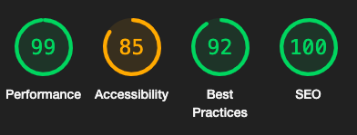


<br>

### **Mobile Results**

The performance of the page load is hindered by the Bootstrap and JQuery links added to launch the welcome modal. 

<br>

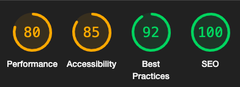

<br>

## **Manual Testing**

<br>

### **Testing User Stories:**

<br>

| Goals | How are goals achieved? |
| --- | --- | 
| **Site User** |     
|        |                                                  
| Visitors|         
**1.** I want a fun and engaging educational experience that helps with my spelling.
The site is fully interactive and control of the game is intuitive. The fun aspect is brought by design elements such as fun images and hidden toilet humour. There is feedback to let the player know how they are progressing. 3-letter spelling challenges help younger children with their learning without discouraging them.
**2.** I want to be engaged and encouraged to hit certain spelling targets to keep the experience interesting and challenging. 
| A large collection of words has been input into the wordCollection array and so the challenges are varied and interesting. In addition to this there is feedback to let the player know how they are progressing. 
**3.** I need the game to be responsive over a range of device sizes. 
| Flexbox has been used to achieve responsive layout and media queries add more layout complexity at smaller screen sizes. 
**4.**  I want to be able to keep track of my incorrect and correct guesses. 
| Green ticks for correct answers and red crosses for incorrect answers are used to give players feedback about each spelling they submit. The red x's only increment upwards after 3 tries have been used up so as not to discourage young users.
**5.** I want clear and concise feedback each time I submit a correct or incorrect answer. 
The score counter displayed in the middle of the screen provides this continual feedback during game play. Modal alert boxes are triggered at various intervals, providing concise feedback. A bespoke message informs the user what the word was after 3 wrong inputs 
**6.** I want easy intuitive access to an explanation of how to play the game.
| An instruction modal pops up at page load using Bootstrap and communicates the game instructions clearly. 
**7.** I want to be greeted by game that looks like it has been designed with me in mind. 
| The imagery is fun and clear and the colour palette bright and appealing to young users. 
|        
<br>

### **Further Testing:**

<br>

Full testing has been carried out on the following devices:

* Macbook Pro 2021 14 inch M1 Pro
* MacBook Air 
* iPhone 13

The following browsers were used to test on each device:

* Google Chrome
* Firefox
* Safari

<br>

| Browser Compatibility |  |        |       |                        
| :---: | :---:  | :---:   | :---:  |
|       | Chrome | Firefox | Safari |  
| Appearance | Good | Good | Good |
| Responsiveness | Good | Good | Good |

<br>

Lastly, the game was tested extensively by the developer's son and his friend. They were both able to navigate through it without issue and enjoyed the experience and challenge. 

## **Bugs**

<br>

### **Known Bugs:**

<br>

**1.**   When the game is being viewed in Chrome Dev tools, the welcome instructions modal box reopens once more after being closed. The game has been tested on several devices outside of Google dev tools and this issue has not arisen again but the developer considers it a possibility. This would not effect the game play but is something that may benfit from troubleshooting in the future.

**2** The following error shows up in the console when the page is loaded: "Failed to load resource: the server responded with a status of 404 ()". This seems to have been caused by out-of-date extensions within the code institute template. This error does not effect the proper functioning of the game but is something that the developer would like to investigate and research further once the project has been submitted. 

**3** A 404 error pops up in the console. This is due to outdated extensions on the CI template. A 404 error page has been mentioned as a future feature. 

<br>

### **Solved Bugs:**

<br>
 
**1.** When the newGame function was run after a word was successfully spelled, the letters in the boxes cleared but not the colours. This also triggered the window alert [`Sorry, you have no more tries! The word is ${word}`;]. This was solved by removing this function altogether and keeping the structure of the game simple. The new word can now only be generated by clicking the recycle button. 


**2.**  The gameboard allowed the user to submit words less than 3-letters, even after a warning modal had popped up. This issue was fixed by adding 'return' to line 101 of the code to escape out of the action. This was pointed out by a classmate, Benjamin Riordan after I had posted about the issue on Slack. 

```js

    if (currentWordArray.length !== 3) {
      window.alert("Word should be 3 letters!");
    return ;
    }

```

**3.** An 'open modal' button that was added underneath the keyboard in order to allow the user to return to the instructions page prevented the overlay from lifting. Unfortunately, after some research provided no clues as to why, the open modal button and event listener were removed from the game as it was felt that the benefit of having the option to re-read the instructions did not outway the complexity of the bug fix, given the limited time left to complete the project. 

**4.** The game board was allowing users to delete previously checked lines. After a very productive tutorial session, the below line of code wsa added to the handleDelete function that solved the issue by prevented indexes 2 and 5 being deleted.

```js

// Conditional statement below ensures that letters from already checked rows cannot be deleted, ie indexes 2 and 5- bug fix
  if (currentWordArray.length > 0) {
    const lastLetterIndex = currentWordArray.length -1;

    if (lastLetterIndex !== 2 || lastLetterIndex !== 5) {
      const removedLetter = currentWordArray.pop();
      guessedWords[guessedWords.length - 1] = currentWordArray;

      const lastLetterEl = document.getElementById(String(availableTiles - 1));

      lastLetterEl.textContent = "";

      availableTiles = availableTiles - 1;
    } else {
      console.log('action not allowed; cannot delete indexes 2 and 5!');
    }

  }

```
**4** Fontawesome icon that represented the delete button on the keyborad was preventing the proper functioning of the eventListener. This issue was resolved with the assistance of a classmate Matthew Shepherd. A CSS style was added (see below) that allowed it to be clicked. The issue can be read about here: [Font Awesome icon preventing click] (https://stackoverflow.com/questions/21653978/font-awesome-icon-preventing-click-in-parent-button)

```css

#pointer-event {
  pointer-events: none;
}

```
___
<br>

# Deployment

## **To deploy the project**

The site was deployed to GitHub pages. The steps to deploy a site are as follows:

1. It is important to first ensure that you have commited and pushed any recent changes in your gitpod.io workspace, do this first by typing: *git add .* then press *return* in the terminal window, followed by *git commit -m "ADD NOTES HERE"*, press *return* and, finally *git push*. You are now ready to deploy. 
2. Open GitHub and from the menu on the left, choose your repository. 
3. In the GitHub repository, navigate to the **Settings** tab on the top right corner.

4. Once in Settings, navigate to the **Pages** tab on the left hand side.

5. Scroll to **Source**, select the branch **main**, then click save. 

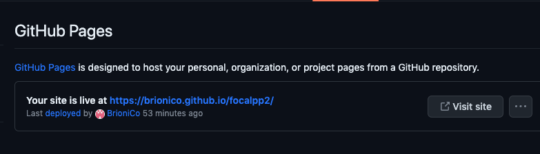

6. The page should refresh. You may need to manually refresh a few times. As you can see from the image above, your deployed site address should display across a ribbon display. 

**Note**: For my first deployment, I needed to choose a Jekyll theme in order to have my site deployed. Github has instructions for this eventuality : [GitHub](https://docs.github.com/en/pages/setting-up-a-github-pages-site-with-jekyll/adding-a-theme-to-your-github-pages-site-using-jekyll)
 
The live link to the Github repository can be found here - [Github repo](https://brionico.github.io/focalpp2/)

## **To fork the repository on GitHub**

A copy of the GitHub Repository can be made by forking the GitHub account. This copy can be viewed and changes can be made to the copy without affecting the original repository. These are the steps that should be followed to fork the repository: 

1. Log in to **GitHub** and locate the [repository](https://brionico.github.io/focalpp2/).
2. On the right hand side of the page inline with the repository name is a button called **'Fork'**, click on the button to create a copy of the original repository in your GitHub Account.

 (Note that this approach was not utilised by the developer for this project due to an initial lack of understanding/reluctance about embarking on the process);

## **To create a local clone of this project**
This is how you clone a project from GitHub:

1. Under the repository’s name, click on the **code** tab.
2. In the **HTTPS** section, under **local** click on the two squares icon to copy the given URL or else use *right-click_copy* or *command* + *C* for Mac, or *Ctrl* + *C* for PC. 

3. Open your terminal in the work space you would like the repository cloned to. 
4. Type **git clone** and then paste the URL you have copied from GitHub.
5. Press *enter* and the local clone will have been created. 

[Back to top](<#contents>)

# **Credits**

* I used this [https://www.youtube.com/watch?v=j7OhcuZQ-q8] tutorial by Ian Lenihan to sketch out the basic structure of game. 
* This tutorial was also used as reference [How to build a Wordle Clone](https://www.youtube.com/watch?v=4-s3g_fU7Vg)
* Referenced this [YouTube](https://www.youtube.com/@KevinPowell) when considering how to make the site responsive without having to use too many media queries.
* To create the instructions modal, I used some code from this tutorial: [Bootstrap modal Tutorial Republic](https://www.tutorialrepublic.com/faq/how-to-launch-bootstrap-modal-on-page-load.php) and this tutorial: [Modal, Free Code Camp](https://www.freecodecamp.org/news/how-to-build-a-modal-with-javascript/)

<br>

## **Media**

* [Royalty free images used for the game logo and word hint pictures](https://uxwing.com/)

<br>

## **Acknowledgements**

<br>


The site was completed as a Portfolio 2 Project piece for the Full Stack Software Developer (e-Commerce) Diploma at the [Code Institute](https://codeinstitute.net/). 
I would like to thank my mentor [Precious Ijege](https://www.linkedin.com/in/precious-ijege-908a00168/) for his help and guidance. I would also like to thank the Code Institute Slack community for all the invaluable information I found there, the tutorial sessions from student help as well as our Cohort Facilitator Alan Bushnell for the very useful weekly stand-up sessions and general insights, support and information.

In particular I would also like to thank two of my classmates, Benjamin Riordan and Matthew Shepherd who repeatedly took time out of their own studies to help me out with issues I was having. 

This was a challenging project for me and there is plenty of room for improvement with my finished project but I am happy with what I have achieved and eager to implement more exciting features in the future. 

Brioni Connolly 2023.

[Back to top](<#contents>)


